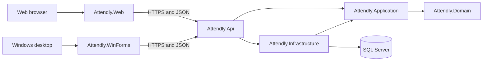
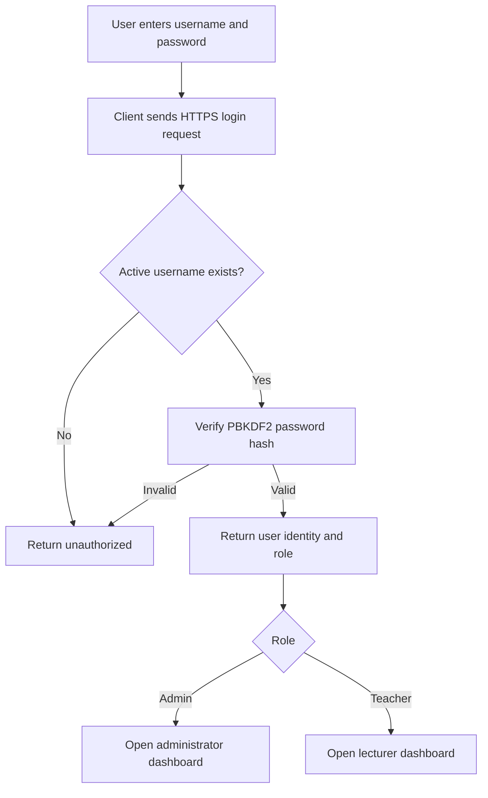
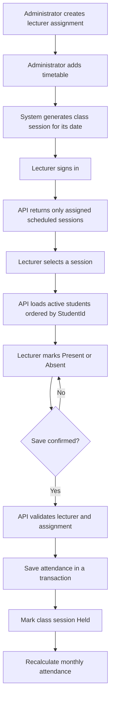
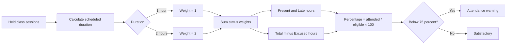
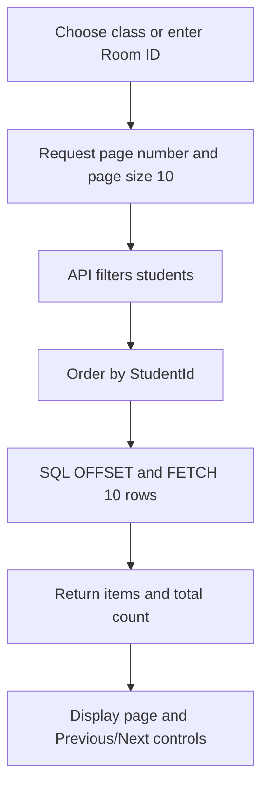

# Attendly Unified — Flow Charts

## System architecture

Only the API connects to SQL Server. Database credentials are never stored in the web browser or WinForms client.

## Login flow

## Attendance workflow

## Attendance calculation

## Student paging flow

