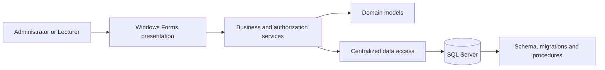
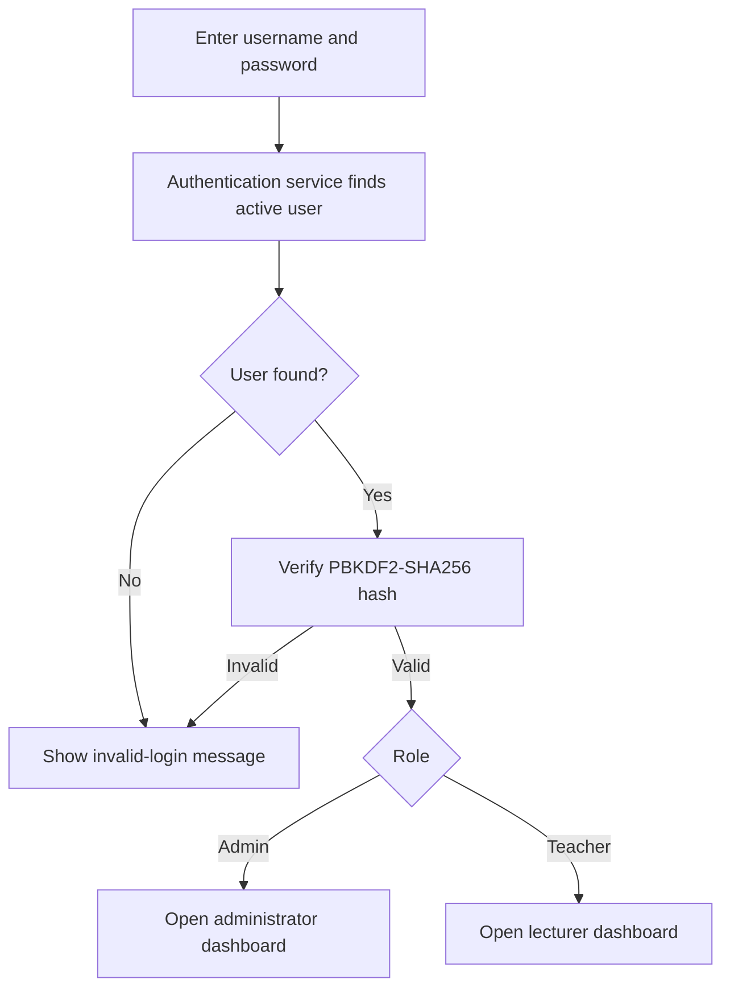
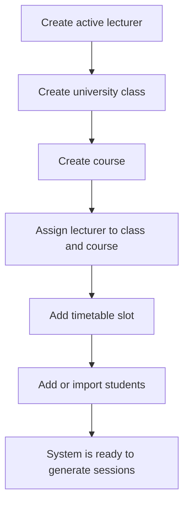
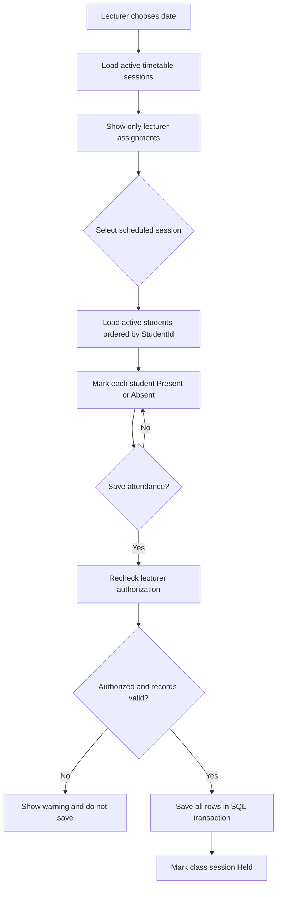
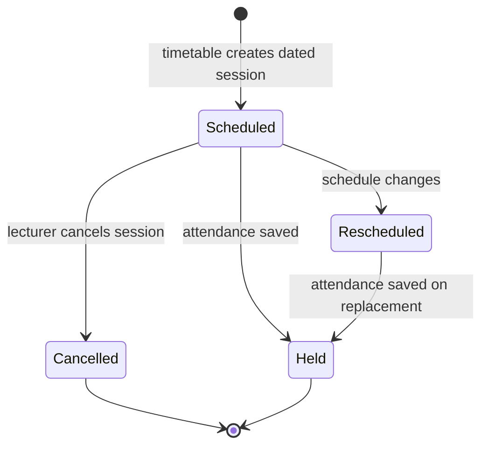
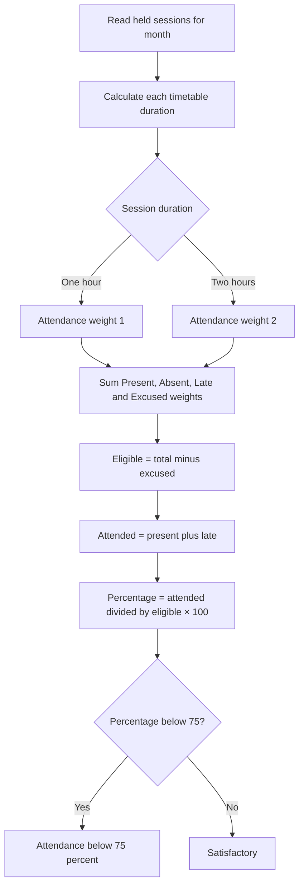
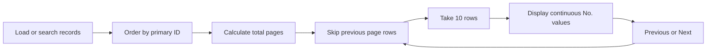
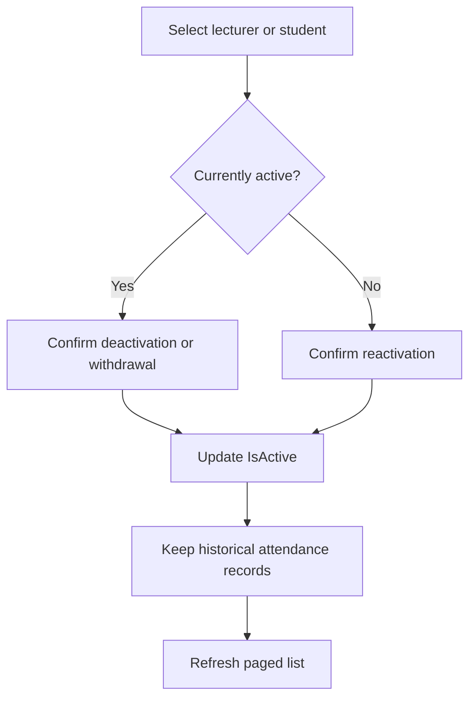

# Student Attendance System — Flow Charts

## WinForms architecture

## Login and role selection

## Administration workflow

## Take-attendance workflow

## Timetable and session lifecycle

## Weighted attendance calculation

## Ten-record list paging

## Status update workflow

